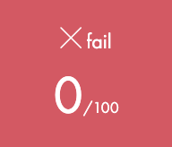
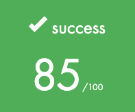
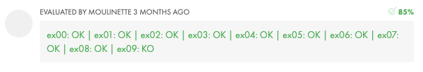
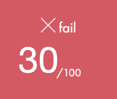
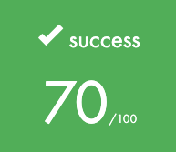
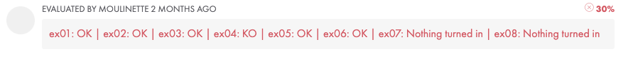
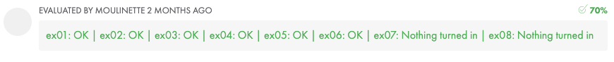

<h1 align="center">Piscine_42</h1>

This repo is a global snapshot of my piscine, during July 2023 at 42 Perpignan.

The "Piscine" is a 4 weeks admission test , consisting in learning basic CS skills such as using a VCS, Shell commands and scripting and of course good old C.

Despite being distorded by various reasons (mostly because I forgot to logout quite often), my log time was on average between 10 and 12h per day.

  

I ended up with level 9.

I did from c_00 to c_08, boths shells and all rushes. Did not make BSQ.

  

Here is a quick summary of each block, each one consisting in learning a global concept about programming :

<h2 align="center">shell_00</h2>

| 1st Try | 2nd Try |
| :---: | :---: |
|  |  |

|  | Moulinette Grade |
| :---: | :---: |
| 1st Try |  |
| 2nd Try |  |

shell_00 is all about discovering basic shell commands and getting familiar with it, ssh printing, and exploring authorisations.

<h2 align="center">shell_01</h2>

| 1st Try | 2nd Try | 3rd Try | 4th Try |
| :---: | :---: | :---: | :---: |
|  |  |   |   |

|  | Moulinette Grade |
| :---: | :---: |
| 1st Try |  |
| 2nd Try |  |
| 3rd Try |  |
| 4th Try |  |

shell_01 is all about diging into advanced shell commands, exploring piping and scripting possibilities. 

shell_00 is all about discovering basic shell commands and getting familiar with it, ssh printing, and exploring authorisations.
