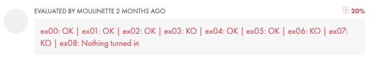

<h1 align="center">Piscine_42</h1>

This repo is a global snapshot of my piscine, during July 2023 at 42 Perpignan.

The "Piscine" is a 4 weeks admission test , consisting in learning basic CS skills such as using a VCS, Shell commands and scripting and of course good old C.

Despite being distorded by various reasons (mostly because I forgot to logout quite often), my log time was on average between 10 and 12h per day.

  

I ended up with level 9.

I did from c_00 to c_08, boths shells and all rushes. Did not make BSQ.

  

Here is a quick summary of each block, each one consisting in learning a global concept about programming :

<h2 align="center">shell_00</h2>

| 1st Try | 2nd Try |
| :---: | :---: |
|  |  |

|  | Moulinette Grade |
| :---: | :---: |
| 1st Try |  |
| 2nd Try |  |

shell_00 is all about discovering basic shell commands and getting familiar with it, ssh printing, and exploring authorisations.

<h2 align="center">shell_01</h2>

| 1st Try | 2nd Try | 3rd Try | 4th Try |
| :---: | :---: | :---: | :---: |
|  |  |   |   |

|  | Moulinette Grade |
| :---: | :---: |
| 1st Try |  |
| 2nd Try |  |
| 3rd Try |  |
| 4th Try |  |

shell_01 is all about diging into advanced shell commands, exploring piping and scripting possibilities.

<h2 align="center">c_00</h2>

| 1st Try |
| :---: |
|  |

|  | Moulinette Grade |
| :---: | :---: |
| 1st Try |  |

c_00 is our first C module. It's about exploring basic syntax, conditionals statements and understanding ASCII.

<h2 align="center">c_01</h2>

| 1st Try |
| :---: |
|  |

|  | Moulinette Grade |
| :---: | :---: |
| 1st Try |  |

c_01 is crucial. We learnt about pointers, arrays, and understanding the concept of string.

<h2 align="center">c_02</h2>

| 1st Try | 2nd Try | 3rd Try |
| :---: |
|  |
|  |
|  |

|  | Moulinette Grade |
| :---: | :---: |
| 1st Try |  |
| 2nd Try |  |
| 3rd Try |  |

c_02 is a module dedicated to strings.

<h2 align="center">c_03</h2>

| 1st Try | 2nd Try | 3rd Try |
| :---: |
|  |
|  |
|  |

|  | Moulinette Grade |
| :---: | :---: |
| 1st Try |  |
| 2nd Try |  |
| 3rd Try |  |

c_03 is also a module dedicated to strings.

<h2 align="center">c_04</h2>

| 1st Try |
| :---: |
|  |

|  | Moulinette Grade |
| :---: | :---: |
| 1st Try |  |

Note : I got 85 as a module grade despite moulinette grading me only at 70. It depends on my humans evaluators grades. It happens sometimes.

c_04 is also manipulating strings, with a major challenge of your piscine : ft_atoi. Understanding this function will be crucial.

<h2 align="center">c_05</h2>

| 1st Try | 2nd Try | 3rd Try |
| :---: |
|  |
|  |
|  |

|  | Moulinette Grade |
| :---: | :---: |
| 1st Try |  |
| 2nd Try |  |
| 3rd Try |  |

c_05 is an introduction to recursive programing through maths functions.

<h2 align="center">c_06</h2>

| 1st Try | 2nd Try |
| :---: |
|  |
|  |

|  | Moulinette Grade |
| :---: | :---: |
| 1st Try |   |
| 2nd Try |  |

c_06 might be a short module, but we learn to use a very new syntax : argc and argv. Two new friends that makes our programs more versatiles.

<h2 align="center">c_07</h2>

| 1st Try |
| :---: |
|  |

|  | Moulinette Grade |
| :---: | :---: |
| 1st Try | c_08</h2>

| 1st Try | 2nd Try |
| :---: |
|  |
|  |

|  | Moulinette Grade |
| :---: | :---: |
| 1st Try |   |
| 2nd Try |  |

c_08, my last module, was all about header files, macros and understanding how it works withing a bigger project's context.

<h2 align="center">Exam_00</h2>

| |
| :---: |
|  |

<h2 align="center">Exam_01</h2>

| |
| :---: |
|  |

<h2 align="center">Exam_02</h2>

| |
| :---: |
|  |

<h2 align="center">Final_Exam</h2>

| |
| :---: |
|  |

<h2 align="center">rush_00</h2>

| |
| :---: |
|  |

First rush was easy peasy. Working together despite having different levels was challenging, especially for harmonising our code.

<h2 align="center">rush_01</h2>

| |
| :---: |
|  |

We trully lacked of time on this one, we were on the edge of having something functionnal.

<h2 align="center">rush_02</h2>

| |
| :---: |
|  |

Buggy and not-functionnal project, way beyond our understanding. At least we tried.

